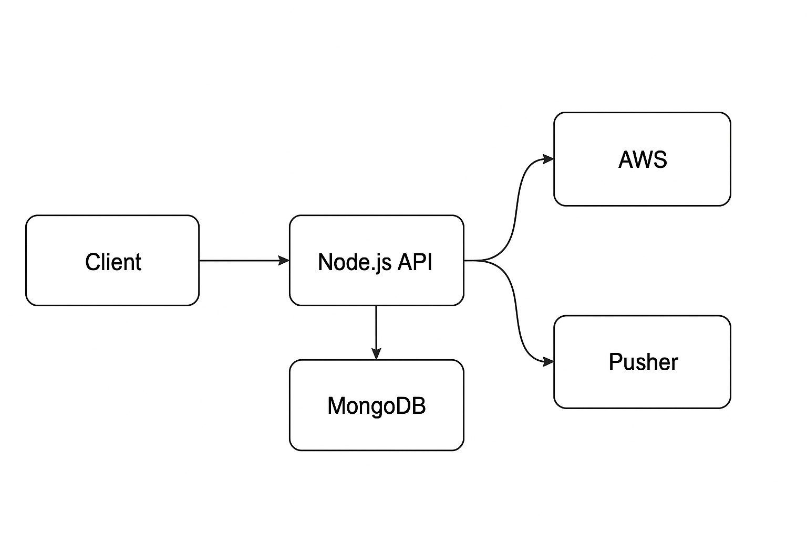

# Project Overview

This project provides examples to help companies transition from legacy technologies to modern solutions. It covers key areas such as:

- **XML to JSON**: Simplifying data formats for better performance.
- **Node.js Restful APIs**: Building faster server-side applications.
- **EC2 to ECS**: Migrating from EC2 to ECS for better scalability and management.
- **Docker for Local Development**: Using Docker to improve local development workflows.
- **Custom Linux Packages**: Creating custom packages for faster processing.

## Description

This is a Node-based RESTful API and client-server application designed to process and transform data. The application utilizes the following technologies:

- **TypeScript**: Ensures type safety and enhances code maintainability.
- **NestJS**: A framework for building efficient, scalable server-side applications.
- **MongoDB**: A NoSQL database used for storing and retrieving data efficiently.
- **Docker**: Provides containerization for local development and deployment.
- **AWS-SDK**: Interfaces with AWS services, enabling cloud-based storage and processing.
- **Pusher**: Facilitates real-time communication between the server and clients.



This is an Lerna [independant](https://github.com/lerna/lerna/tree/master/commands/init#--independent) managed monorepository along with `commitizen`

## Usage

### Getting Started

`npm install --global lerna`

#### Installing Dependencies

`lerna bootstrap --hoist --nohoist=webpack*`

#### Uninstalling/Clean node_module Directory

`lerna clean`

Bootstrap the packages in the current Lerna repo. Installs all of their dependencies and links any cross-dependencies.

### Basic Usage

#### Listing Packages

View all packages versions and type `lerna ls -al`

Dependency graph `lerna ls -al --graph`

#### Conventional Commits

All commits in this project must conform to [Conventional Commits](https://conventionalcommits.org) Guide lines using commitizen

`npm install -g commitizen`

```shell
> git add .
> git cz
> git push
```

### Tag Creation/Cutting

To create `git tag` for a release and generate `CHANGELOG.md` from commits run the following `lerna` command

```shell
> lerna version major --conventional-commits
```

## Portal

React.js frontend for interacting with Webservice

### Portal Technologies

- [React 16](https://reactjs.org/docs/getting-started.html)
- [Boostrap 4](https://react-bootstrap.github.io/getting-started/why-react-bootstrap/)
- [React Router](https://reacttraining.com/react-router/web/guides/quick-start)
- Sass

[Portal README](portal/)

## Webservice

Node.js API webservice for internally managing client experiences

### Web Service Technologies

- [Nest.js](https://docs.nestjs.com/)
- [Typescript](https://www.typescriptlang.org/docs/handbook/basic-types.html)
- [Mongodb](https://www.mongodb.com/)
- [Mongoose ORM](https://mongoosejs.com/)
- [xmlbuilder-js](https://github.com/oozcitak/xmlbuilder-js/wiki)
- [Express for API Resources](https://bitbucket.org/truechoicesolutions/portal-webservice/wiki/API%20Endpoint%20Naming)

[Webservice README](webservice/)

```

```
