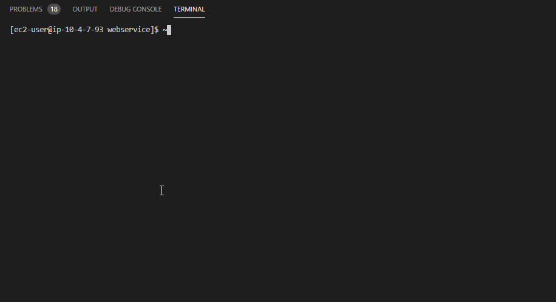

# Portal Webservice


## Description

Node.js API webservice for internally managing client applications.
Project path is `port-webservice/webservice`

## Feature Roadmap

- [x] Authenication
- [x] User (CRU)
- [x] Stack Manager
- [x] Notification
- [x] Logging and Auditing
- [x] XML Loader (single, batch and file upload)
- [ ] XML Import History
- [x] Basic Content (CRU)
- [-] XML Output
- [ ] Content Manager (tags and platform releases)
- [-] Content History (CRU)
- [ ] Asset Manager/Deployer (tags and platform releases)
- [ ] Client (CRU)

---

## API Documentation and Examples

- API documentation and examples located are here https://webservices.truechoice.io/api/
- Local development use http://localhost:3000/api/

### How to Document Your API

Document an api using `@ApiTags('AWS E2C Server Manager')` decorator in controllers. More information can be found here [Nestjs OpenAPI(Swagger)](https://docs.nestjs.com/recipes/swagger)

---

## Installation

```bash
> lerna bootstrap --hoist --nohoist=webpack*
```

or

```bash
> npm install
```

---

## Environment Configuration

Copy the `.env.example` to `.env` and ensure that `.env` is ignored by git

### Local vs Production and Port Number Settings

1. Ensure that `APP_ENV=local` so that Private IPs will be used while connected to the AWS VPN Client
2. By default the app's port number is 3000 to override this or any reason set `APP_PORT=3003` to the port number you want.

Example:

```env
APP_ENV=local
APP_PORT=3000
```

### Mongo Database configuration in `/.env` enviorment file located in the root of the application

```env
MONGO_USER = username
MONGO_PASSWORD = password
MONGO_DB = databasename
```

### AWS API access

```env
AWS_ACCESS_KEY_ID = fakeMyKeyId
AWS_SECRET_ACCESS_KEY = fakeSecretAccessKey
AWS_REGION =
```

### Pusher access

```env
PUSHER_APP_ID="1234"
PUSHER_APP_KEY="1234567"
PUSHER_APP_SECRET="123456789"
```

[See Bitbucket Wiki for demo access](https://bitbucket.org/truechoicesolutions/portal-webservice/wiki/Home)

---

## Running and Testing

```bash
# development
> npm run start

# watch mode
> npm run start:dev

# production mode
> npm run start:prod
```

### Testing

```bash
# unit tests
> npm run test:watch

# e2e tests
> npm run test:e2e

# test coverage
> npm run test:cov
```

#### End-to-End (e2e) Testing

Will run batch and single file xml import

```bash
> npm run test:e2e

 ┌─────────┬──────────────────────────────────────────┐
 │ (index) │       XML loading test files (e2e)       │
 ├─────────┼──────────────────────────────────────────┤
 │    0    │ 'e2e_functional_tests-1596298610357.xml' │
 │    1    │    'e2e_prototype-1596298560644.xml'     │
 │    2    │    'e2e_prototype-1596298575329.xml'     │
 │    3    │   'e2e_prototype_pb-1596298589199.xml'   │
 │    4    │   'e2e_prototype_pb-1596298589258.xml'   │
 └─────────┴──────────────────────────────────────────┘
```

---

## REST Resource Naming Best Practices

RESTful URI should refer to a resource that is a thing (noun) instead of referring to an action (verb) because nouns have properties which verbs do not have – similar to resources have attributes. Some examples of a resource are:

```bash
# To create
POST /api/users

# To get all users
GET /api/users

# To get particular user.
GET /api/users/<id>

# To update particular user.
PUT /api/users/<id>

# To delete particular user
DELETE /api/users/<id>
```

## Workspaces, Modules, & Nest CLI

This application is divided into two (2) sections:

- Core and Feature modules in `src`
- Supporting Libraries in `libs`

### Root Module

`./src/app.module.ts` - pirmary module that loads all modules. Once you have created a new module edit this file to reference your new module or library as needed.

### All Freature Modules as Library

Instead of developing modules in `./src/` feature modules are to be developed as libraries. Which will allow for better communication amongst other modules as well as greater portability.

`./libs/my-shared-module/my-shared-module-ts` - shared modules that are easily accessed as a local scoped package using `@truechoice` namespace

### Nest CLI

Mainly used for generating and scaffolding functionality within the applicaiton and used by `npm` scripts. [More details here](https://docs.nestjs.com/cli/overview)

### Adding New Functionality

When creating a new module, class, or controller, and alike use the `nest g` cli to generate these files along with their corresponding test specification file.

#### Nest Example

```bash
> nest g class users
```

```bash
> nest --help

Usage: nest <command> [options]

Options:
  -V, --version                                   output the version number
  -h, --help                                      output usage information

Commands:
  new|n [options] [name]                          Generate Nest application
  build [options] [app]                           Build Nest application
  start [options] [app]                           Start Nest application
  generate|g [options] <schematic> [name] [path]  Generate a Nest element
    Available schematics:
      ┌───────────────┬─────────────┐
      │ name          │ alias       │
      │ application   │ application │
      │ angular-app   │ ng-app      │
      │ class         │ cl          │
      │ configuration │ config      │
      │ controller    │ co          │
      │ decorator     │ d           │
      │ filter        │ f           │
      │ gateway       │ ga          │
      │ guard         │ gu          │
      │ interceptor   │ in          │
      │ interface     │ interface   │
      │ middleware    │ mi          │
      │ module        │ mo          │
      │ pipe          │ pi          │
      │ provider      │ pr          │
      │ resolver      │ r           │
      │ service       │ s           │
      │ library       │ lib         │
      │ sub-app       │ app         │
      └───────────────┴─────────────┘
  info|i                                          Display Nest CLI details
  update|u [options]                              Update Nest dependencies
  add <library> [args...]                         Add a library
```

#### Loading a library using @truechoice

```javascript
import { Module } from '@nestjs/common';
import { AppController } from './app.controller';
import { AppService } from './app.service';
import { MyLibraryModule } from '@truechoice/my-library';

@Module({
  imports: [MyLibraryModule],
  controllers: [AppController],
  providers: [AppService]
})
export class AppModule {}
```

#### Adding Addtional `Controller`, `Services`, `DTOs` etc

Use the `nest` cli to generate starter files for sub-modules, clases etc...

```bash
$ nest g s xml-file
? Which project would you like to generate to? (Use arrow keys)
> src [ Default ]
  auth
  notification
  users
  ssm
  stacks
  aws
(Move up and down to reveal more choices)
```

### Trobleshooting

#### Build Issues

Ensure in `webservice/nest-cli.json` that `webpack` isn't being used for compiling by default it's **`true`**:

```json
 "compilerOptions": {
    "webpack": false
 }
```

---

## Deployment

To deploy the webservice to the production server:

### via Slack

In the #devops Slack channel, enter the following:

```slack
/deploy webservice
```

#### via Jenkins GUI

Trigger a build of the [webservice-tag](http://jenkins.truechoice.io/job/webservice-tag/) Jenkins job

### via CodeBuild

Add `[WSBuild]` to the commit message to trigger build [webservice project](https://us-west-2.console.aws.amazon.com/codesuite/codebuild/995365708897/projects/webservice/history?region=us-west-2)

---

## Production Log Montioring

After sshing into the server use the `forever` command to manage the hosting of the web services.

### Basic Usage

```bash
forever list
```

### Find the log file path

```bash
tail -f /home/ec2-user/.forever/1StS.log
```


